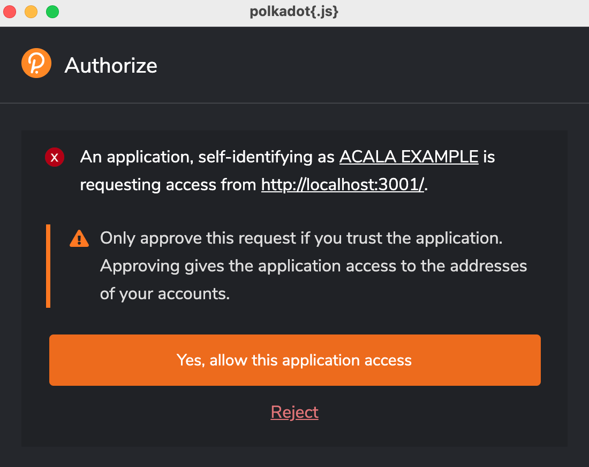
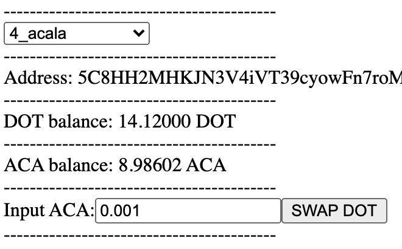
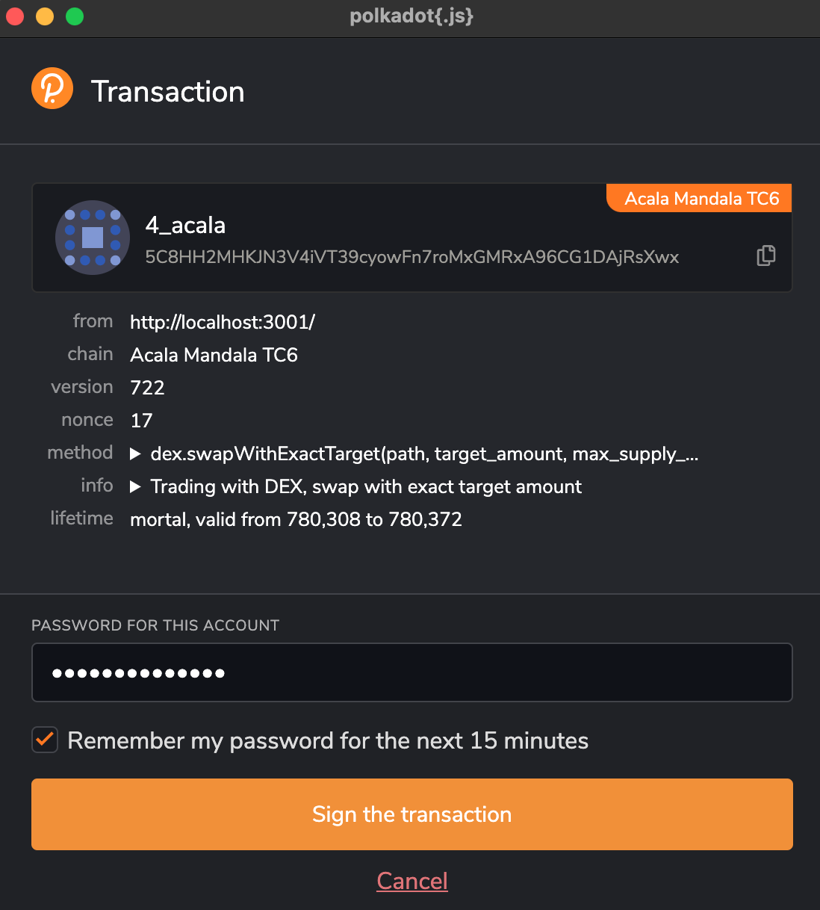
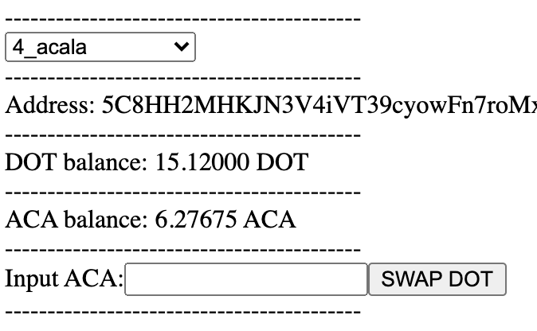
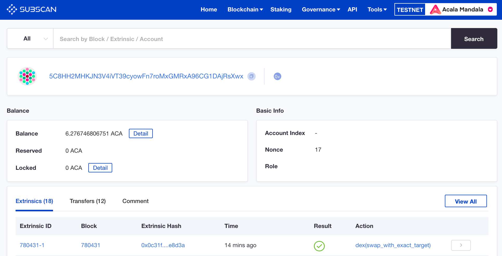
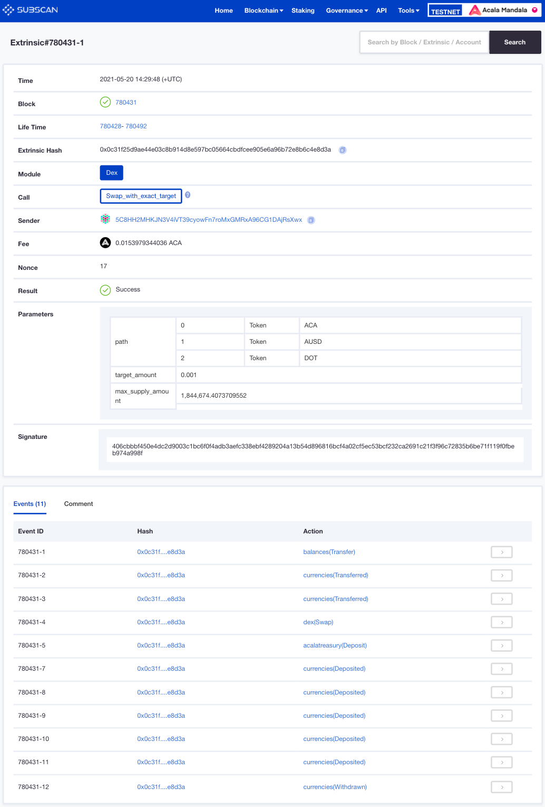

# Getting Started with Create React App

This project was bootstrapped with [Create React App](https://github.com/facebook/create-react-app).

## Available Scripts

In the project directory, you can run:

### `yarn`

To install the relevant packages and dependencies.\

```
yarn install v1.22.10
[1/4] 🔍  Resolving packages...
[2/4] 🚚  Fetching packages...
[3/4] 🔗  Linking dependencies...
warning "@acala-network/api > @acala-network/api-derive > @open-web3/orml-types@0.9.3" has unmet peer dependency "@polkadot/typegen@4.*".
warning " > @polkadot/extension-dapp@0.37.2" has unmet peer dependency "@polkadot/util@*".
warning " > @polkadot/extension-dapp@0.37.2" has unmet peer dependency "@polkadot/util-crypto@*".
warning " > @testing-library/user-event@12.8.3" has unmet peer dependency "@testing-library/dom@>=7.21.4".
warning "react-scripts > @typescript-eslint/eslint-plugin > tsutils@3.20.0" has unmet peer dependency "typescript@>=2.8.0 || >= 3.2.0-dev || >= 3.3.0-dev || >= 3.4.0-dev || >= 3.5.0-dev || >= 3.6.0-dev || >= 3.6.0-beta || >= 3.7.0-dev || >= 3.7.0-beta".
[4/4] 🔨  Building fresh packages...
✨  Done in 521.46s.
```

sidebar: you may ignore the ^ warnings

### `yarn start`

Runs the app in the development mode.\
The page will reload if you make edits.\
You will also see any lint errors in the console.

### `yarn test`

Launches the test runner in the interactive watch mode.\
See the section about [running tests](https://facebook.github.io/create-react-app/docs/running-tests) for more information.

### `yarn build`

Builds the app for production to the `build` folder.\
It correctly bundles React in production mode and optimizes the build for the best performance.

The build is minified and the filenames include the hashes.\
Your app is ready to be deployed!

See the section about [deployment](https://facebook.github.io/create-react-app/docs/deployment) for more information.

### `yarn eject`

**Note: this is a one-way operation. Once you `eject`, you can’t go back!**

If you aren’t satisfied with the build tool and configuration choices, you can `eject` at any time. This command will remove the single build dependency from your project.

Instead, it will copy all the configuration files and the transitive dependencies (webpack, Babel, ESLint, etc) right into your project so you have full control over them. All of the commands except `eject` will still work, but they will point to the copied scripts so you can tweak them. At this point you’re on your own.

You don’t have to ever use `eject`. The curated feature set is suitable for small and middle deployments, and you shouldn’t feel obligated to use this feature. However we understand that this tool wouldn’t be useful if you couldn’t customize it when you are ready for it.

## What To Expect

When you start the app in development mode, using the following command `yarn start` and you will see the following:

```
Compiled successfully!

You can now view acala-example in the browser.

  Local:            http://localhost:3000
  On Your Network:  http://<ip-address>:3000

Note that the development build is not optimized.
To create a production build, use yarn build.
```

Open [http://localhost:3000](http://localhost:3000) (if not automatically done) to view it in your default browser.

Depending on you're setup, you might be presented with a window from `Polkadot.js` to authorize access to `ACALA EXAMPLE` and here is a sample screen-shot. Go ahead and give access to the app.



sidebar: if port 3000 is currently being used by another process, it will give you an option to pick the next available (i.e. 3001)

Next, on your default browser, a new tab will open, and you'll see something like this:



Assuming you've got the pre-requisites sorted ...have an Acala testnet account with some test `DOT` and `ACA` from the faucet, we will attempt to swap some ACA for DOT using the `DEX` module.

1st select the appropriate wallet account in the drop-down.\
2nd input a small amount of ACA e.g. `0.001` and click on the **SWAP DOT** button.

Now you'll be prompted to sign the transaction, which will call the method `dex.swapWithExactTarget(path, target_amount, max_supply_amount)`. Go ahead and sign the transaction.



When the transactions executes successfully, you'll notice some changes on the screen. The `DOT` balance increased by ~1 and `ACA` balance decreased by ~2.



That's it, you've successfully managed to build a simple react app, which uses Acala's API to submit a DEX SWAP transcation on testnet.

For a more in-depth inspection of the above transaction, you may look for your account using any of the polkadot explorers. Here I am using **subscan** and the URL will be something like this...

```
https://acala-testnet.subscan.io/account/<acala-account>?tab=transfer
```

Paste this URL in your default browser and replace it with your acala-acccount and it should pull up all the Extrinsics.



You're looking for the most recent `Extrinsic ID`, and click on the respective `Extrinsic Hash`.



Now you'll be able to see more details for the Extrinsic, covering areas such as:

```
Time
Block
Life Time
Extrinsic Hash
Module
Call
Sender
Fee
Nonce
Result
Parameters
Signature
Events
```

## Learn More

You can learn more in the [Create React App documentation](https://facebook.github.io/create-react-app/docs/getting-started).

To learn React, check out the [React documentation](https://reactjs.org/).

### Code Splitting

This section has moved here: [https://facebook.github.io/create-react-app/docs/code-splitting](https://facebook.github.io/create-react-app/docs/code-splitting)

### Analyzing the Bundle Size

This section has moved here: [https://facebook.github.io/create-react-app/docs/analyzing-the-bundle-size](https://facebook.github.io/create-react-app/docs/analyzing-the-bundle-size)

### Making a Progressive Web App

This section has moved here: [https://facebook.github.io/create-react-app/docs/making-a-progressive-web-app](https://facebook.github.io/create-react-app/docs/making-a-progressive-web-app)

### Advanced Configuration

This section has moved here: [https://facebook.github.io/create-react-app/docs/advanced-configuration](https://facebook.github.io/create-react-app/docs/advanced-configuration)

### Deployment

This section has moved here: [https://facebook.github.io/create-react-app/docs/deployment](https://facebook.github.io/create-react-app/docs/deployment)

### `yarn build` fails to minify

This section has moved here: [https://facebook.github.io/create-react-app/docs/troubleshooting#npm-run-build-fails-to-minify](https://facebook.github.io/create-react-app/docs/troubleshooting#npm-run-build-fails-to-minify)
