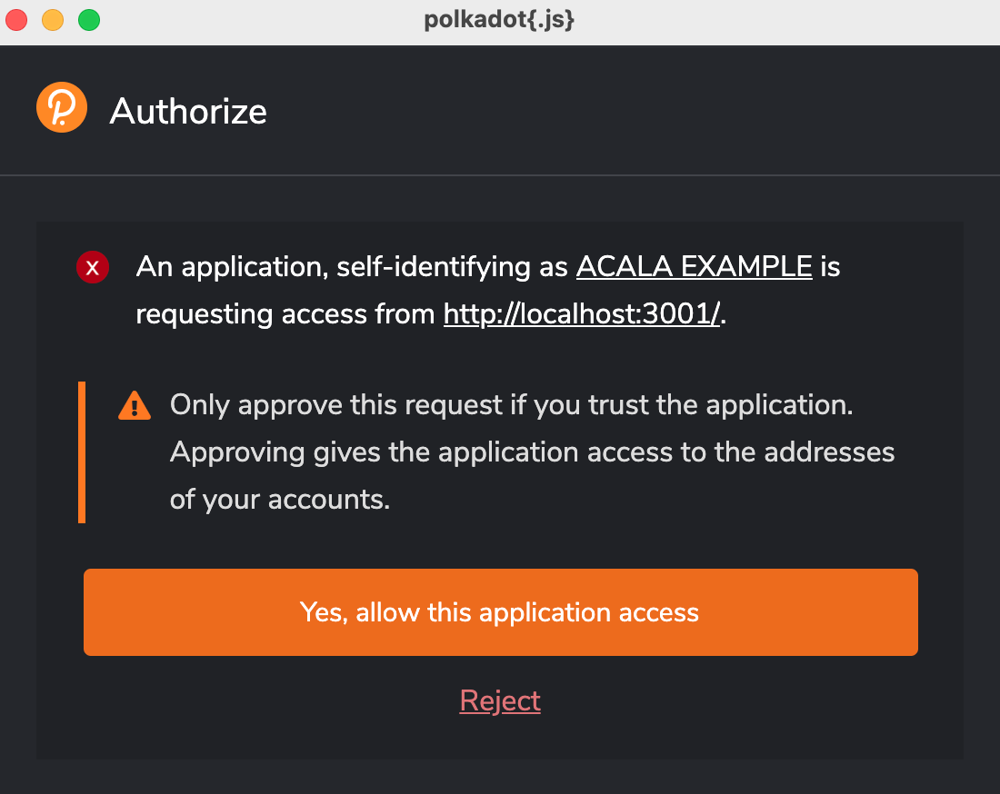
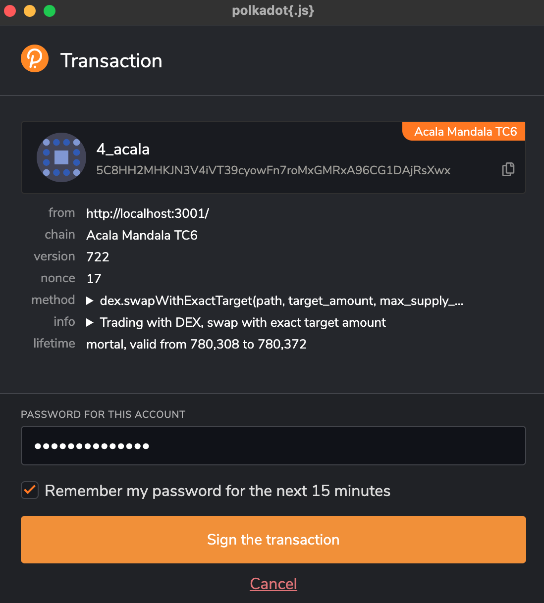

# Frontend Example (Swap app)

To run the frontend app, you can follow the guide here.

## Requirements
- installed `yarn`
- installed polkadot.js browser extension with set up accounts

## Available Scripts

In the project directory, you can run:

### `yarn`

To install the relevant packages and dependencies.\

```
yarn install v1.22.10
[1/4] 🔍  Resolving packages...
[2/4] 🚚  Fetching packages...
[3/4] 🔗  Linking dependencies...
warning "@acala-network/api > @acala-network/api-derive > @open-web3/orml-types@0.9.3" has unmet peer dependency "@polkadot/typegen@4.*".
warning " > @polkadot/extension-dapp@0.37.2" has unmet peer dependency "@polkadot/util@*".
warning " > @polkadot/extension-dapp@0.37.2" has unmet peer dependency "@polkadot/util-crypto@*".
warning " > @testing-library/user-event@12.8.3" has unmet peer dependency "@testing-library/dom@>=7.21.4".
warning "react-scripts > @typescript-eslint/eslint-plugin > tsutils@3.20.0" has unmet peer dependency "typescript@>=2.8.0 || >= 3.2.0-dev || >= 3.3.0-dev || >= 3.4.0-dev || >= 3.5.0-dev || >= 3.6.0-dev || >= 3.6.0-beta || >= 3.7.0-dev || >= 3.7.0-beta".
[4/4] 🔨  Building fresh packages...
✨  Done in 521.46s.
```

sidebar: you may ignore the ^ warnings

### `yarn start`

Runs the app in the development mode.\
The page will reload if you make edits.\
You will also see any lint errors in the console.


## What To Expect

When you start the app in development mode, using the following command `yarn start` and you will see the following:

```
Compiled successfully!

You can now view acala-example in the browser.

  Local:            http://localhost:3000
  On Your Network:  http://<ip-address>:3000

Note that the development build is not optimized.
To create a production build, use yarn build.
```

Open [http://localhost:3000](http://localhost:3000) (if not automatically done) to view it in your default browser.

Depending on you're setup, you might be presented with a window from `Polkadot.js` to authorize access to `ACALA EXAMPLE` and here is a sample screen-shot. Go ahead and give access to the app.



sidebar: if port 3000 is currently being used by another process, it will give you an option to pick the next available (i.e. 3001)

Next, on your default browser, a new tab will open. And you will be presented with choice of selecting the account:


After you pick an account from the Choose Account dropdown the app will load your balances and and price of ACA to AUSD.


Assuming you've got the pre-requisites sorted ...have an Acala testnet account with some test `AUSD` and `ACA` from the faucet, we will attempt to swap some ACA for AUSD using the `DEX` module.

1st select the appropriate wallet account in the drop-down.\
2nd input a small amount of ACA e.g. `0.5` and click on the **SWAP ACA** button.

Now you'll be prompted to sign the transaction, which will call the method `dex.swapWithExactSupply(path, supplyAmount, minTargetAmount)`. Go ahead and sign the transaction.



When the transactions executes successfully, you'll notice some changes on the screen. The `ACA` balance decreased by ~0.5 and `AUSD` balance increased.


That's it, you've successfully managed to build a simple react app, which uses Acala's API to submit a DEX SWAP transcation on testnet.

For a more in-depth inspection of the above transaction, you may look for your account using any of the polkadot explorers. Here I am using **subscan** and the URL will be something like this...

```
https://acala-testnet.subscan.io/account/<acala-account>?tab=transfer
```

Paste this URL in your default browser and replace it with your acala-acccount and it should pull up all the Extrinsics.


You're looking for the most recent `Extrinsic ID`, and click on the respective `Extrinsic Hash`.

